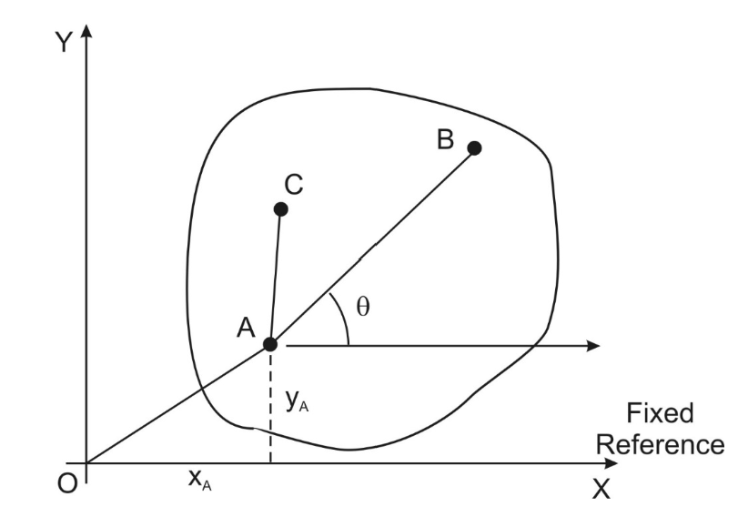

# General Plane Motion

## Properties of Bodies in GPM

1. If a rigid body can move in an arbitrary manner in a plane, its position at any instant can be fixed by three coordinates

In the body shown below, A is a selected reference point and its position is specified by two co-ordinates x A and y A. If B denotes any other point then since AB must remain a straight inextensible line, the position of B is fixed from A by the angle θ of line AB relative to a reference direction. The position of any other point C is fixed from A since the angle CAB is invariant.

    

2. The body has three Degrees of Freedom (X direction, Y direction, rotation about A). 

3. It is invaluable to choose G as the reference point. 
4. The velocity of any particle of the body can be determined from the acceleration components of the reference point, the angular velocity and the angular acceleration of the body. 
5. The acceleration of any particle of the body can be determined from the acceleration components of the reference point, the angular velocity and the angular acceleration of the body 

## Angular Velocity of Bodies in GPM

The angular velocity of a body in GPM is defined as the time derivative of the angel between any straight line in the body and a fixed reference direction.

AB is any line inscribed in the body. Ox is a fixed reference in the plane. Let $\theta$ be the angle between AB and Ox. Then $\Omega$ is:

$$\frac{d\theta}{dt} \quad \textrm{or} \quad \dot{\theta}$$

Angular acceleration ($\alpha\  rad/s^2$ ) is similarly defined as:

$$\frac{d^2\theta}{dt^2} \quad \textrm{or} \quad \ddot{\theta}$$

## Acceleration Components of an Arbitrary Point

We choose G as a reference point for the motion. Let A be any other point. GA makes an instantaneous angle $\theta$ with the reference direction Ox.

Let:

- G have acceleration components $\ddot{x}_g$ and $\ddot{y}_g$
- $\Omega$ be body angular velocity
- $\alpha$ be a body angular acceleration

Then since $\overline{a}_A = \overline{a}_G + \overline{a}_GA$, the acceleration components for A are as shown:

    

## Dynamics Laws of GPM

### The Force Law (GN2)

<b>Sum of the External Forces plus the body Inertia Force = 0</b>

### The Moment Law

<b>Sum about any point of the moments of the External Forces  + the moment of the body Inertia Force acting at G  + the Inertia Couple = 0 </b>

#### <u>Proof of Moment Law</u>

Assume the acceleration of G, the angular velocity $\Omega$ and acceleration $\alpha$. Let A be any other point of the body and (dm) a mass element at A.

    

Sum of moments about O of particle inertia forces 

$$= \int\ \textrm{dm}\{(y_G + r\ sin\theta)(\ddot{x}_G - r\Omega^2\ cos\theta - r\alpha\ sin\theta)-(x_G + r\ cos\theta)(\ddot{y}_G - r\alpha\ cos\theta - r\Omega^2\ sin\theta)\}$$

$$\int\ \textrm{dm}\{y_G\ddot{x}_G - x_G\ddot{y}_G - r\alpha^2 + (\ddot{x}_G - y_G \alpha  + x_G \Omega^2)r\ sin\theta - (\ddot{y}_G + x_G \alpha + y_G\Omega^2)r\ cos\theta \}$$

$$= M\dot{x}_G y_G - M\dot{y}_Gx_G - \alpha \int r^2\ \textrm(dm)$$

$$\qquad + (\ddot{x}_G - y_G\alpha + x_G\Omega^2)\int r\ sin\theta\ \textrm(dm)$$
$$\qquad \qquad- (\ddot{y}_G - x_G\alpha + y_G\Omega^2)\int r\ cos\theta\ \textrm(dm)$$

The last two integrals are 0 making the sum of moments about O of particle inertia forces:

$$= M\dot{x}_G y_G - M\dot{y}_Gx_G - I_G\alpha$$

Hence the moment law for GPM (about any point) is:

$$(\sum \textrm{Moments of External Forces}) + ( M\dot{x}_G y_G - M\dot{y}_Gx_G) + (-I_G\alpha) = 0$$

## Rolling Wheels

### Pure Rolling

Pure rolling motion implies that there is no slip at the contact point:

    

#### Velocity

To find velocity we can draw the following components:

    

For no slip at A:

$$v_a = v_b \quad \textrm{so} \quad v = R\Omega$$

#### Acceleration

Similarly for acceleration:

    

For no slip at A:

$$a - R\alpha = 0 \quad \textrm{so} \quad a = R\alpha$$

> Pure rolling is possible if $F < F_{max}$

