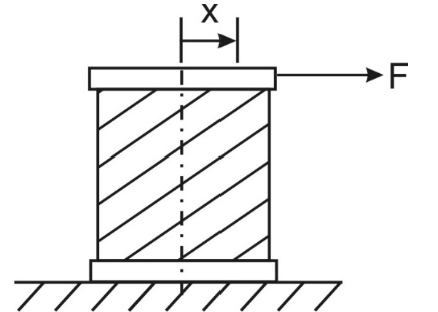

# Oscillatory Motion

## Basic Mechanical Oscillators

Basic Oscillators include:

- Mass and Spring
- Pendulum
- Mass on Beam

If these systems are disturbed they will oscillate with Simple Harmonic Motion (SHM):

    

This is called "Free Vibration" which is motion in response to an initial disturbance. In this ideal case, the oscillation will continues indefinitely once started. In real situation, however, the energy of the motion is gradually lost due to sources of friction at joints or within the materials themselves. This results in the eventual decay of oscillation which is known as Damping:

    

## Forced Vibration

In contrast to free vibration, forced vibration occurs when systems have external dynamics loads applied. These could be of relatively short duration, such as shock loads, earthquakes, or they could be long duration, perhaps periodic as would be the case or unbalanced rotating machines, wave forces on offshore platforms.

## Elasticity and Spring Elements

### Coil Spring

Springs ob ey Hooke's law which states that the ex4ensino of an elastic body is directly proportional to the force applied ($F = K x$). The slope is the spring stiffness K in N/m

    

### Rubber Bush

Shear Load:

    

Extensional Load:

    

### Beams as Spring Elements

Consider the following cantilever:

    

Using the definition of Young's Modulus:

$$y = \frac{Pl^3}{3EI}$$

Rearranging for P:

$$P = (\frac{3EI}{l^3})y$$

Notice this similar to $F = Kx$:

$$\textrm{Flexural Rigidity } = \frac{3EI}{l^3}$$

Consider the following beam fixed at both ends:

    

$$P = (\frac{48EI}{l^3})y$$

$$\textrm{Flexural Rigidity } = \frac{48EI}{l^3}$$

Consider a beam under torsional stress:

    

$$T = \frac{GJ}{l}\theta = \frac{G\pi d^4}{32l}\theta$$

$$\textrm{Torsional stiffness } = \frac{GJ}{l}\theta$$

## Degrees of Freedom

Degrees of Freedom (DoF) refers to the number of coordinates requires to fully specify the instantaneous position of a body in motion. It also specifies the number of natural frequencies a system possesses as well as the number of 'modes' of oscillation. The only systems that will be explored are ones with one degree of freedom. 

### One Degree of Freedom

The following are two examples of systems with one degree of freedom:

    

### Two Degree of Freedom

The following are two examples of systems with two degrees of freedom:

    

## Basic Differential Equation of Free Oscillations

Consider the simplest mechanical oscillator - a single mass restrained by a spring:

    

Let $x(t)$ be the instantaneous position of the mass from its equilibrium point. The most appropriate positive direction will depend on the problem faced nad in the example here it is taken ot the right. A Free-Body Diagram can be drawn adn the D'Alembert form of N2 can be used to write down its laws of motion. 

System FBD:

    

From this we find that:

$$M \ddot{x} + Kx = 0$$

$$\ddot{x} + (\frac{K}{M})x = \ddot{x} + \omega_o^2 x = 0$$

$$\omega_o = \sqrt{\frac{K}{M}}$$

The general solution of this is:

$$x(t) = C_1 cos\ \omega_o t + C_2 sin\ \omega_o t$$

This solution represents SHM. The frequency and period of the oscillation are determined by $\omega_o$ which is termed the "Natural Frequency" of the System. The magnitude of the oscillation is determined by constants $C_1$ and $C_2$

## Applications of Oscillation Theory

Oscillation theory is involved in the understanding of many complex and difficult dynamical areas which impinge on the design and operation of Mechanical Engineering system. Failure due to Oscillating Stress or Metal Fatigue is a major consequence of exposure to prolonged oscillations. There are two categories of oscillations:

1. Free Oscillations. The system responds to initial conditions and there are no external dynamic loads

2. Forced Oscillations. The system response to external dynamic loads wherein resonance is the most significant feature 

### Resonance

When an external cyclic disturbing force or forces has frequency content near to a system free vibration frequency then greatly magnified vibrations can result, leading to failure. This is called resonance. Common sources of cyclic disturbances are:

- rotating out-of-balance forces
- cyclic power sources such as internal combustion engines
- wake shadow effects on rotating turbine blades
- prolonged vibratory ground motion as in earthquakes

Resonance can be illustrated by considering a sinusoidal cyclic force applied to a mass and spring. Here $P_o sin\ \Omega t$ is a force of amplitude $P_o$ oscillating at frequency $\Omega$:

    

With FBD:

    

From this:

$$M \ddot{x} + Kx = P_o sin\ \Omega t$$

$$\ddot{x} + \omega_o^2 x = \frac{P_o}{M} sin\ \Omega t$$

Given the solution of the DE is:

$$x(t) = CF + PI$$

$$x(t) = C_1 cos\ \omega_o t + C_2 sin\ \omega_o t + \frac{P_o sin\ \Omega t}{M(\omega_o^2 - \Omega^2)}$$

The PI is due to external oscillating force which is greatly magnified is $\Omega \rightarrow \omega_o$ and goes to infinity if $\Omega = \omega_o$. In real systems, energy dissipation, or damping, prevents infinite resonant vibration although the levels may be dangerously high:

    

### Effect of Damping

Damping can be represented as a viscosity force that is proportional to the mass velocity and which opposes the motion of the mass. The damping constant is generally given the letter 'C'. With damping the FBD becomes:

    

From this:

$$M \ddot{x} + C\dot{x} + Kx = P_o sin\ \Omega$$

$$\ddot{x} + \frac{C}{M}\dot{x} + \frac{K}{M}x = \frac{P_o}{M} sin\ \Omega$$

Written in canonical Form:

$$\ddot{x} + 2\delta \omega_o \dot{x} + \omega_o^2x = \frac{P_o}{M} sin\ \Omega$$

where:

$$2 \delta \omega_o = \frac{C}{M}$$

$\delta$ is the non-dimensional damping constant and can take several values: $\delta = 0$ for undamped systems, $\delta < 1$ for underdamped systems, $\delta > 1$ for overdamped systems, while $\delta = 1$ indicates a critically damped system.

The DE solution is:

$$x(t) = e^{-\delta \omega_o t}[C_1 cos\ \omega_o t + C_2 sin\ \omega_o t] + \frac{P_o sin(\ \Omega t - \phi)}{M[(\omega_o^2 - \Omega^2) + 4\delta^2 \omega_o^2 \Omega^2]^{\frac{1}{2}}}$$

### Resonant Oscillations

The forcing frequency and damping level have a major impact on how a simple oscillating system behaves as the charts on the following page show. The frequency ratio $r = \frac{\Omega}{\omega_o}$ indicates whether the forcing frequency is above or below the natural frequency.