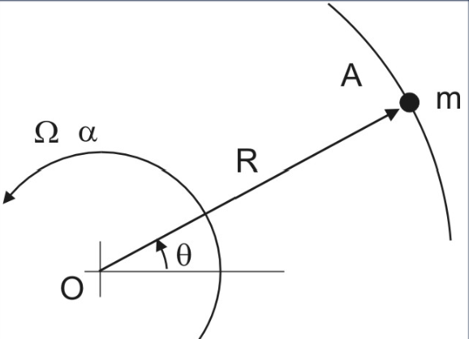
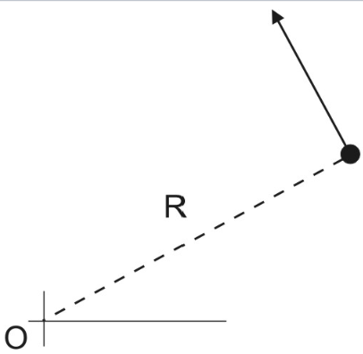
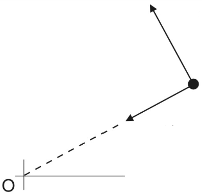
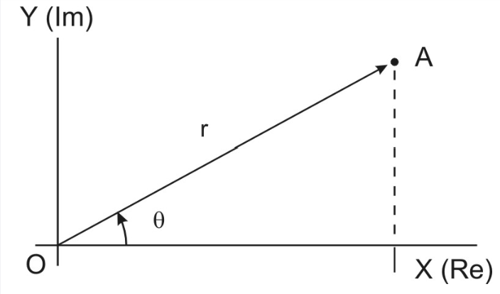
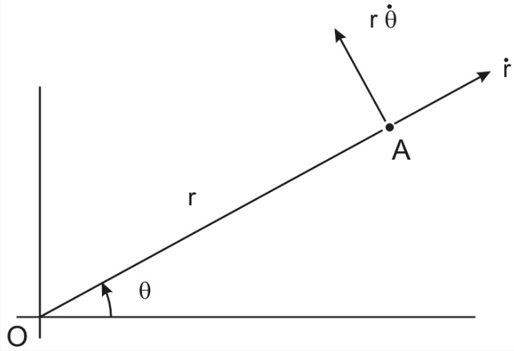
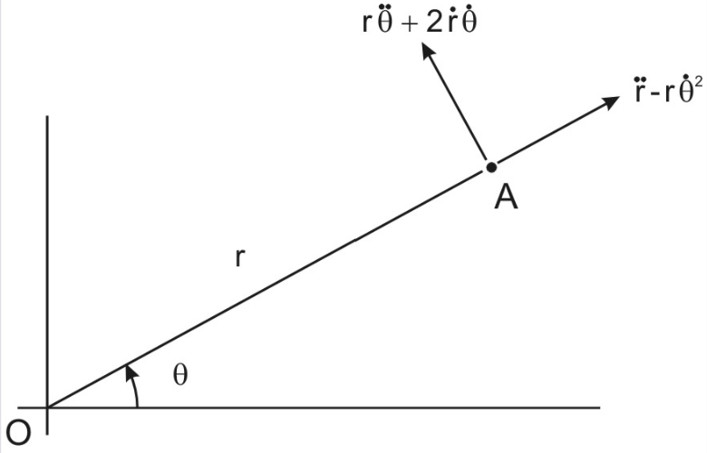

# Particle Motion

## Particles in Circular Motion

For particles with constant radius moving in a circular path we can apply D'Alambert giving the following components:

    

From this we can also find the tangential velocity $v = R \Omega$:

    

Considering the acceleration components:

    

Tangential velocity can be found by differentiating the tangential velocity w.r.t. time and the radial component is the centripetal acceleration acting towards the centre of rotation:

$$a_t = R \alpha \quad \textrm{and} \quad a_{rad} = R \Omega^2 = \frac{v^2}{R}$$

## Particle Motion in Polar Coordinates

It can sometimes be beneficial to convert from Cartesian to Polar Coordinates. These values can be defined using complex numbers:

    

The instantaneous position of a particle can defined as:

$$z = x + iy = re^{i\theta}$$

Differentiating $z$ w.r.t. time gives the velocity:

    

$$\dot{z} = \dot{r} e^{i\theta} + (r \dot{\theta})ie^{i\theta}$$

Where $\dot{r}$ is the component acting radially outwards and $r\dot{\theta}$ is the component acting tangentially. Differentiating $\dot{z}$ w.r.t. time again gives:

    

$$\ddot{z} = (\ddot{r} - r\dot{\theta}^2) e^{i\theta} + (r \ddot{\theta} + 2 \dot{r} \dot{\theta}) ie^{i \theta}$$

Again with radial component $(\ddot{r} - r\dot{\theta}^2)$ and tangential component $(r \ddot{\theta} + 2 \dot{r} \dot{\theta})$

### Centripetal Acceleration

As explored previously the $-r\dot{\theta}^2$ part of the radial component is the centripetal acceleration acting in the negative direction (towards the center).

### Coriolis Acceleration

The $2 \dot{r} \dot{\theta}$ part of the tangential component is the Coriolis acceleration, which is the inertial force that acts on the particle causing the particle to appear to deviate from its path from the frame of reference of the rotating body.