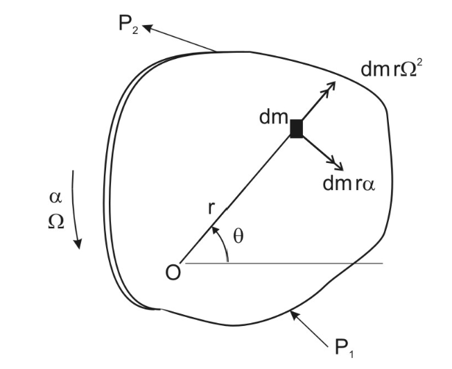
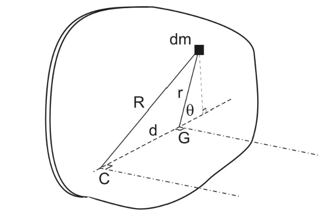
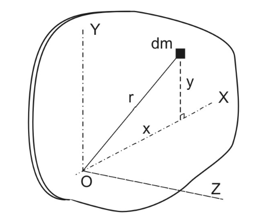
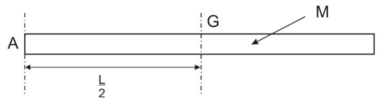
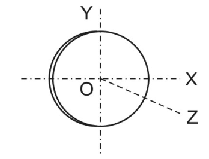
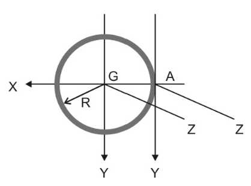
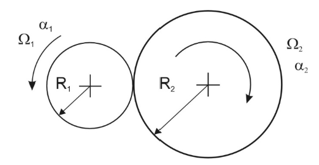
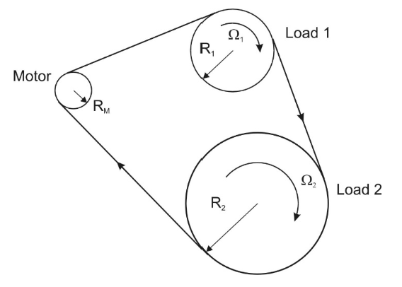
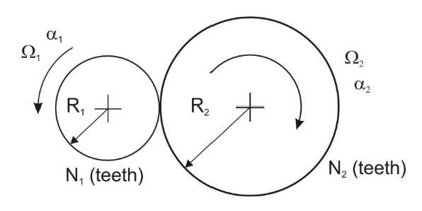

# Rigid Body Motion

Requirements:

- Rigid - implies no deformation during motion
- Length of any inscribed line remains constant
- Angle between any pair of lines remains constant

There are 3 cases of Rigid Body Motion:
1. Pure Translation - Body moves without rotation
2. Fixed Axis Rotation - Body restricted to rotational motion about a designated axis
3. General Plane Motion - Motion is a combination of translation and rotation

## Pure Translation

Pure Translation (PT) means no rotation - All lines in the body remain in fixed directions during the motion. All points in the body have the same velocity and acceleration during the motion.

### Laws of Motion for a Rigid body in PT

1. Generalised Newton 2 applies:

<b>Sum of External Forces plus System Inertia Forces = 0</b>

2. General Moment Theorem Applies:

<b>Sum of moments about any point = 0</b>

    

Acceleration is the same for all particles:

$$\overline{a}_j = \overline{a}_g = \overline{a}$$

Sum of moments about O of Particles Inertia Force:

$$\sum \overline{R}_j m_j \times (-\overline{a}) = (\sum m_j \overline{R}_j) \times (-a)$$

$$M \overline{R}_g \times (-\overline{a})= \overline{R}_g\times M(-\overline{a})$$

## Fixed Axis Rotation

Requirements:

- All mass particles move in circular paths about the fixed axis (through O)

- O might or might not coincide with the centre of gravity G

- Body has angular motion - angular velocity and acceleration

Examples:

- Pulley
- Hinged Bar
- Meshed Gears

> Note: Rolling wheels are NOT an example of Fixed Axis Rotation as there is translation present

### Laws of Notion for Fixed Axis Rotation

1. The main result is the Law of Fixed Axis Rotational Motion, usually written:

<b>Sum of Moments of the External Forces about the fixed axis in the direction of the Angular Acceleration = (Mass Moment of Inertia about the axis) x (Angular Acceleration fo the body)</b>

or 

$$\sum \textrm{Moments about point O} = I_o\alpha$$

which can also be written in D'Alembert form as:

$$\sum \textrm{Moments about point O} + -I_o\alpha = 0$$

This can be interpreted as meaning that for a body moving in fixed axis rotation, the sum of moments about the fixed point is zero if the FBD includes an Inertia Couple ($I_o \alpha$) drawn in the opposite direction to $\alpha$

2. Generalised N2 also applies to teh case of Fixed axis Rotation of course:

<b>Sum of the external forces + System Inertia Force = 0</b>

The external forces will include will include forces at the pivot point. The system inertia force is $M \times \overline{a}_g$ drawn in the opposite direction to $\alpha$

### Proof of FAR

    

O is the fixed point. Let $\Omega$ and $\alpha$ represent angular motion in the direction of resultant moment due to $P_1$ and $P_2$. Let dm be a mass particle at radius $r$. Inertia forces are:

- (dm) $r \Omega^2$ &ensp;&nbsp; radially
- (dm) $r \alpha$ &emsp;      tangentially

From General Moment Theorem:

$$\sum \textrm{Moments of External Forces} + \sum - (\textrm{dm} \ r \alpha) r = 0$$

$$\sum \textrm{Moments of External Forces} = (\sum r^2\ \textrm{dm}) \alpha$$

The RHS is $I_o \alpha$ where:

$$I_o = \sum r^2 \ \textrm{dm} = \textrm{Moment of Inertia of Body about Fixed Axis}$$

## Moment of Inertia of Body

The Mass moment of inertia for the body about the X axis is given by:

$$I_x = \sum r_j^2\ \textrm{dm}_j = \int\limits_{BODY} r^2\ \textrm{dm}$$

Inertia is the mass distribution of the body about a specified axis through a specified point where $r$ is the perpendicular distance form a mass particle to the axis. The result is in $kg \cdot m^2$ and will always be positive. 

### Solid Bars

About an axis X through one end:

$$I_x = \frac{1}{3} ML^2$$

About an axis X through the centre:

$$I_x = \frac{1}{12} ML^2$$

> Note: This makes intuitive sense as a larger moment will be generated if the axis of rotation is about and end rather than the centre.

### Uniform Disc

About an axis through the centre:

$$I_x = \frac{1}{2} ML^2$$

## Transformation Theorems

There are two theorems that can be helpful in calculating the moment of inertia:

1. Parallel Axis Theroem
2. Perpendicular Axis Theorem

### Parallel Axis Theorem

If $I_g$ is the moment of inertia of a body about an axis through G and is $I_c$ is the moment of inertia about a parallel axis through some other point C:

$$I_c = I_g + M d^2$$

where M is the body mass and d is the perpendicular distance between the parallel axes.

#### <u>Proof of Parallel Axis Theorem</u>

Consider an element of mass dm distances r and R from the axsi passing through G and C:

    

Using the cosine law ($R^2 = r^2 + d^2 +  2rd \ cos\theta$):

$$I_c = \int R^2 \ \textrm{dm} = \int (R^2 = r^2 + d^2 +  2rd \ cos\theta)\ \textrm{dm}$$

$$I_c = \int R^2 \ \textrm{dm} + d^2\int \textrm{dm} + 2d \int r\ cos\theta \ \textrm{dm}$$

converting $r\ cos\theta$ back into cartesian ($x$):

$$\int r\ cos\theta \ \textrm{dm} = 0 \quad \textrm{and} \quad d^2 \int \textrm{dm} = Md^2$$

Substituting back into the original formula:

$$I_c = I_g + Md^2$$

### Perpendicular Axis Theorem

If O is any point, Ox and Oy are a pair of rectangular axes in the plane of the body and O is an axis perpendicular to the body, then for O:

$$I_z = I_x + I_y$$

> Note: This only applies to "thin bodies" in the form of thin plates or laminae

#### <u>Proof of Perpendicular Axis Theorem</u>

    

Moment of Inertia of particle of mass dm about Oz can be broken into components along Ox and Oy:

$$r^2\  \textrm{dm} = (x^2 + y^2)\ \textrm{dm} = x^2 \ \textrm{dm} + y^2 \ \textrm{dm}$$

$$I_z = \int r^2 \ \textrm{dm} = \int x^2\ \textrm{dm} + \int y^2\ \textrm{dm}$$

$$I_z = I_x + I_y$$

### Using the Theorems

1. Moment of Inertia of a bar about a transverse axis through G:

    

$$I_A = \frac{ML^2}{3}$$

$$I_A = I_G + M(\frac{L}{2})^2$$

$$I_G = I_A - \frac{ML^2}{4} = \frac{ML^2}{12}$$

2. Moment of Inertia of a Circular Disc about a Diameter

    

$$I_z = \frac{1}{2}MR^2$$

$$I_z = I_x + I_y \quad \textrm{and from symmetry:} \quad I_x = I_y$$

$$I_x = \frac{I_z}{2} = \frac{1}{4}MR^2$$

3. Moments of Inertia of a Steel Ring for a point on the circumference

    

$$I_{GZ} = MR^2 = I_{GX} + I_{GY}$$

$$I_{GX} = I_{GY} = \frac{1}{2}MR^2$$

$$I_{AX} = I_{GX} = \frac{1}{2}MR^2$$

$$I_{AX} = I_{GY} + MR^2 = \frac{3}{2}MR^2$$

$$I_{AZ} = I_{GZ} + MR^2 = 2MR^2$$

### Radius of Gyration

Any moment of inertia can be written in the form:

$$I_o = MK^2$$

where L is an equivalent length quantity called the Radius of Gyration

For a uniform disc of radius R about the centre, $I_o = \frac{1}{2}MR^2$. The Radius of Gyration of a uniform disc about its centre is $K = \frac{R}{\sqrt{2}}$

## Kinematics of Rotating Systems

### Friction Drive

Friction drives operate on the basis that there is sufficient perpendicular reaction between  the wheels to allow efficient transfer of power between the wheels.

    

For no slipping there must be no relative motion at the contact point. hence the tangential velocities of the two discs must be equal:

$$v_1 = v_2 \qquad \textrm{so} \qquad R_1\Omega_1 = R_2\Omega_2$$

Similarly

$$\alpha_2 = \frac{R_1}{R_2} \alpha_1 \qquad \textrm{and} \qquad \Omega_2 = \frac{R_1}{R_2} \Omega_1$$

### Belt Drive

Belt drives are similar to Friction Drives, but to prevent excessive stretching or slacking of the belt the tangential velocities of the loads must equal that of the motor.

    

Hence

$$R_m\Omega_m = R_1\Omega_1 = R_2\Omega_2$$

### Meshed Gears

Gear teeth are designed and manufactured carefully to achieve as close to uniform transmission of rotary motion as possible from the drive gear to the driven gear wheel. Perfect gear wheels in mesh may be represented simply as two circular discs in perfect rolling contact with no slip.

    

The circular pitch of the teeth must be identical:

$$\frac{2\pi R_1}{N_1} = \frac{2\pi R_2}{N_2} \qquad \textrm{or} \qquad \frac{R_1}{R_2} = \frac{N_1}{N_2}$$

The result for two rolling discs in rolling frictional contact was:

$$\Omega_2 = \frac{R_1}{R_2} \Omega_1$$

Hence for meshed gears:

$$\Omega_2 = \frac{N_1}{N_2} \Omega_1 \qquad \textrm{and} \qquad \alpha_2 = \frac{N_1}{N_2} \alpha_1$$

## Rotating Unbalance

TODO: Complete