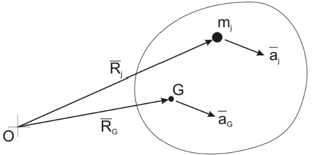

# Rigid Body Motion

Requirements:

- Rigid - implies no deformation during motion
- Length of any inscribed line remains constant
- Angle between any pair of lines remains constant

There are 3 cases of Rigid Body Motion:
1. Pure Translation - Body moves without rotation
2. Fixed Axis Rotation - Body restricted to rotational motion about a designated axis
3. General Plane Motion - Motion is a combination of translation and rotation

## Pure Translation

Pure Translation (PT) means no rotation - All lines in the body remain in fixed directions during the motion. All points in the body have the same velocity and acceleration during the motion.

### Laws of Motion for a Rigid body in PT

1. Generalised Newton 2 applies:

<b>Sum of External Forces plus System Inertia Forces = 0</b>

2. General Moment Theorem Applies:

<b>Sum of moments about any point = 0</b>

    

Acceleration is the same for all particles:

$$\overline{a}_j = \overline{a}_g = \overline{a}$$

Sum of moments about O of Particles Inertia Force:

$$\sum \overline{R}_j m_j \times (-\overline{a}) = (\sum m_j \overline{R}_j) \times (-a)$$

$$M \overline{R}_g \times (-\overline{a})= \overline{R}_g\times M(-\overline{a})$$

## Fixed Axis Rotation

Requirements:

- All mass particles move in circular paths about the fixed axis (through O)

- O might or might not coincide with the centre of gravity G

- Body has angular motion - angular velocity and acceleration

Examples:

- Pulley
- Hinged Bar
- Meshed Gears

### Laws of Notion for Fixed Axis Rotation

1. The main result is the Law of Fixed Axis Rotational Motion, usually written:

<b>Sum of Moments of the External Forces about the fixed axis in the direction of the Angular Acceleration = (Mass Moment of Inertia about the axis) x (Angular Acceleration fo the body)</b>

or 

$$\sum \textrm{Moments about point O} = I_o\alpha$$

which can also be written in D'Alembert form as:

$$\sum \textrm{Moments about point O} + -I_o\alpha = 0$$
