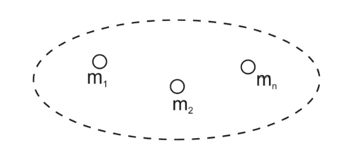
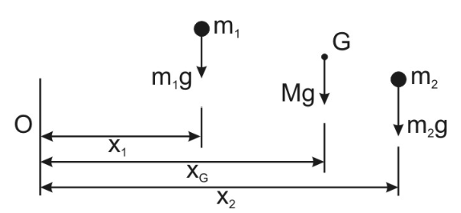
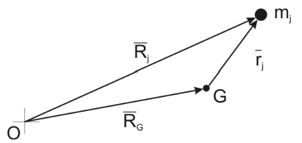
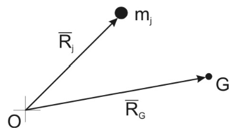
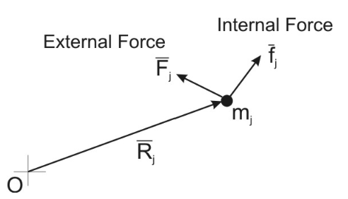

# Systems of Bodies

## Dynamics of a General System

Building on particle we can now consider an abstract general case referred as a System of Particles

    

A System of Particles will have the following properties:

- A boundary 
- A set of mass particles, which may be joined up or interacting in some way
- Constant total mass
- Centre of gravity (G) where the system's total weight may be located in a gravity field

## Internal and External Forces

System forces are either internal or external. The distinction rests on Newton's Third Law:

*Internal Forces* - Forces whose reactions also act on the system

*External Forces* - Forces whose reactions act outside the system

Internal forces occur in equal and opposite collinear paris, which both act on the system. Hence it can be easily shown that:

- The vector sum of internal forces for any system is zero.
- The sum, about any point, of the moments of internal forces for any system is zero.

## Locating the Centre of Gravity

G is the point where the total weight of the system may be considered to act. In a gravity field, the total acting weight acting at G gives the same moment about any reference point as the sum of the moments of the individual particle weights.

Suppose the following system:

    

the location of the centre of gravity form O in the direction x is found by taking moments about O:

$$M x_g = m_1 x_1 + m_2 x_2$$

Generalising to any number of masses and directions:

$$M x_g = \sum m_i x_i, \quad M y_g = \sum m_i y_i, \quad M z_g = \sum m_i z_i$$

In continuous bodies the sums can be replaced by integrals. This can also be represented by position vectors. Let $\overline{R}_g$ be the position vector of G from O and $\overline{R}_j$ be the position vector of a typical particle $m_j$ from O. G can be located according to:

$$M\overline{R}_g = \sum^n m_j \overline{R}_j$$

Extending this result we can draw $\overline{r}_j$ as the position vector form $m_j$ from G giving:

    

$$\overline{R}_j = \overline{R}_G + \overline{r}_j$$

Hence:

$$M\overline{R}_G = \sum m_j (\overline{R}_g + \overline{r}_j)$$

$$M\overline{R}_G = \sum m_j \overline{R}_g  + \sum m_j \overline{r}_j$$

Which simplifies to:

$$\sum m_r \overline{r}_j = 0$$

The sum of the first moments about G is 0

## Law of Motion of the Mass Centre

Given the following system:

    

Let $m_j$ be a system mass particle, $\overline{F}_j$ be the external force on $m_j$, $\overline{f}_j$ be the internal force on $m_j$. N2 applies to $m_j$ as follows:

$$m_j \ddot{\overline{R}}_j = \overline{F}_j + \overline{f}_j$$

Writing N2 for every particle and summing both sides:

$$\sum^n m_j \ddot{\overline{R}}_j = \sum^n \overline{F}_j + \sum^n \overline{f}_j$$

The sum of internal forces are always 0 giving:

$$\sum m_j \ddot{\overline{R}}_j = \frac{d^2}{dt^2}(\sum m_j \overline{R}_j ) = \frac{d^2}{dt^2}(M\overline{R}_g) = M \ddot{\overline{R}}_g$$

$$M \ddot{\overline{R}}_g = \sum m_j \ddot{\overline{R}}_j$$

This can be extended to **Generalised Newton 2** or **GN2**:

<b>System Mass x Acceleration of G = Sum of External Forces</b>

The D'Alembert version can be written as:

<b>The sum of the External Forces adn the System Inertia Force = 0</b>

The System Inertia Force is the **Total Mass x Acceleration of G** directed in an opposite direction to the acceleration of G. Free Body Diagrams of a system drawn with External Forces and the System Inertia Force must balance in any direction.

It can be proved that, for any system at rest or in motion, the sum of the moments of the external forces and the particle inertia forces about any point is zero:

    

Using N2 in D'Alembert form:

$$\overline{F}_j +  \overline{f}_j + (-m_j a_j) = 0$$

Multiple terms by $\overline{R}_j$ and sum over j:

$$\sum \overline{R}_j \overline{F}_j + \sum \overline{R}_j \overline{f}_j + \sum \overline{R}_j (-m_j a_j) = 0$$

$$\sum \overline{R}_j \overline{F}_j + \sum \overline{R}_j (-m_j a_j) = 0$$

Hence the sum of moments of the system external forces and the particle inertia forces is zero

