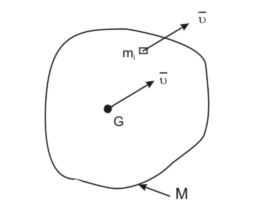
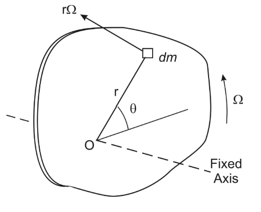
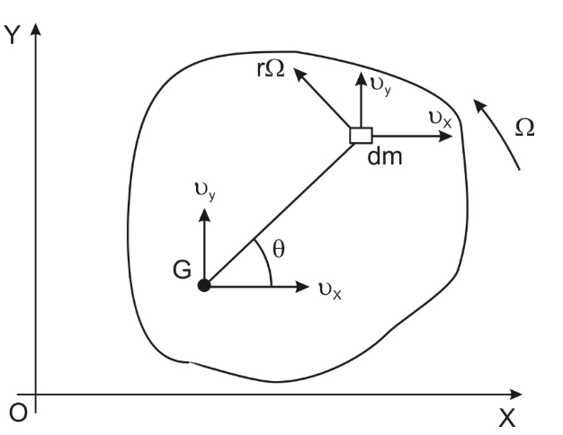
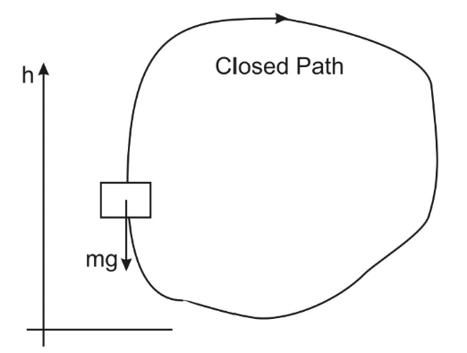
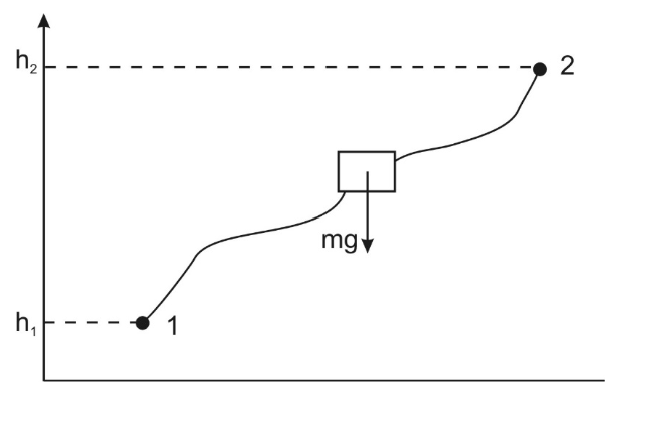

# Work - Energy Approach

## The Power Method for Systems

The power method provides and alternative to the classical Newtonian/D'Alembert approach for linked systems:

- It can give quick answers in many cases
- It considers teh system a sa whole and does not require separate FBDs
- It is based on the concepts of work, energy and power
- The approach requires the identification of power sources and sinks for the system

To use the method you will need to have:

1. Kinetic Energy
2. Potential Energy
3. Work Done by forces and torques/moments
4. Power of forces and torques/moments

## Recap

### Energy

> Energy is a scalar quantity which is the capacity of a system to do work. It can be measured in Joules (J), Newton-Metres (Nm) or Watt-seconds (Ws)

1. Kinetic Energy (KE) - the energy due to union

For a mass particle &emsp; $KE = \frac{1}{2}mv^2 = \frac{1}{2}m(v \cdot v)$

For a system &emsp;&emsp;&emsp;&emsp;$KE = \textrm{Sum of KE of component parts}$

2. Potential Energy (PE) - the energy due to the position of a body or system

Gravitational PE of a body &emsp;$PE = Mgh$

PE in a spring &emsp;&emsp;&emsp;&emsp;&emsp;&ensp;&emsp;$PE = \frac{1}{2}kx^2$

### Work

> Work is a scalar quantity and can be positive or negative. Work is done by forces (and torques) when the mass particles on which they act move through a distance (in J or Nm)

Work done by a Force  &emsp;$W = F \times d$

Work done by a Torque &nbsp;$W = \tau \times \theta$

### Power

> Power is the work rate or work done/second by a force or torque and can be positive or negative. Positive means energy is flowing into the system whereas negative means energy is flowing out of the system. It can be measured in W, J/s or Nm/s. 

Power of a Force $P = F \times v$

Power of a Torque $P = \tau \times \Omega$

## Power Theorem for Systems - Excluding PE

Let 1 denote an initial state and, 2, a later one.

The energy balance gives:

$$KE_1 + (\textrm{Work done } 1 \rightarrow 2 \textrm{ on system by all system forces}) = KE_2$$

This means that the work done on the system by all the system forces/torques is equal to the increase in system KE. Hence, the basic System Power Theorem is:

$$\textrm{Total work done per second by all system forces/torques}  = \frac{d}{dt} (\textrm{System } KE)$$

> LHS is the net power supplied to the system

## Expression for Kinetic Energy

Derivations for each of the three cases of Rigid Body Motion from single particle results:

### Rigid Body in Pure Translation

    

$$KE_{particle} = \frac{1}{2}m_iv_i^2$$

$$KE_{body} = \frac{1}{2}\sum m_iv_i^2 = \frac{1}{2}\{\sum m_i\}v^2 = \frac{1}{2}Mv^2$$

### Rigid Body in Fixed Axis Rotation

    

For particle dm, velocity is $r\Omega$ in a direction tangential to circle of radius $r$:

$$KE_{particle} = \frac{1}{2} \textrm{dm}(r\Omega)^2$$

For the body:

$$KE_{body} = \int \frac{1}{2}(r\Omega)^2 \textrm{dm} =  \frac{1}{2} (\int r^2 \textrm{dm}) \Omega^2$$

$$KE_{body} = \frac{1}{2} I_o \Omega^2$$

### Rigid Body in General Plane Motion

take G as a reference point. Let $v_x$, $v_y$ be the velocities of G at any instant, $\Omega$ be the angular velocity of the body

    

For particle, velocity components are:

$$v_x - r\Omega \  sin \theta\quad \textrm{in X direction}$$ 

$$v_y + r\Omega \  cos \theta\quad \textrm{in Y direction}$$ 

$$KE_{particle} = \frac{1}{2}\textrm{dm}[(v_x - r\Omega \  sin \theta)^2 + (v_y + r\Omega \  cos \theta)^2 ]$$

For the body:

$$KE_{body} = \frac{1}{2} M(v_x^2 + v_y^2) + \frac{1}{2}I_G\Omega^2$$

## Conservative Forces - Special Work Property

    

The work done by the weight force of  amass in any closed path of movement is zero. 

Considering the work done by weight during a change of position:

    

The work done by weight force in any change of position is the negative of the increase in potential energy:

$$\textrm{Work done } (1 \rightarrow 2) = -mg(h_2 - h_1) = PE_1 - PE_2$$

## Power Theorem for Systems - Including Potential Energy

The result excluding PE:

$$\textrm{Net power of all system forces/torques}  = \frac{d}{dt} (\textrm{System } KE)$$

accounted for potential energy implicitly through the weight forces of the system. It can be modified to include system potential energy explicitly.

We know that:

$$\textrm{Work done by weights in } \Delta t = - \Delta PE$$

Which leads to:

$$\textrm{Power of system weight forces}  = -\frac{d}{dt} (\textrm{System } PE)$$

Which can be rearranged to:

$$\textrm{Net power of system forces/torques(excl. weight) } - \frac{d}{dt} (\textrm{System } PE) = \frac{d}{dt} (\textrm{System } KE)$$

Finally:

$$\textrm{Net power of system forces/torques } = \frac{d}{dt} (\textrm{System } KE + PE)$$

